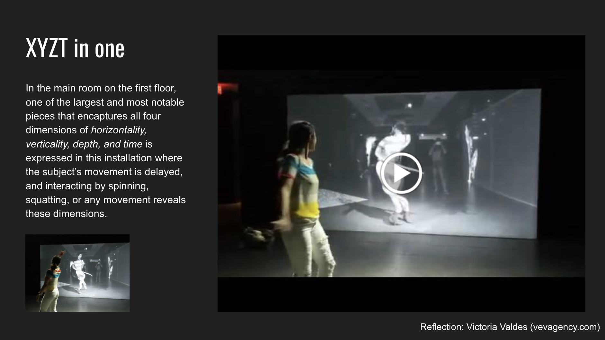
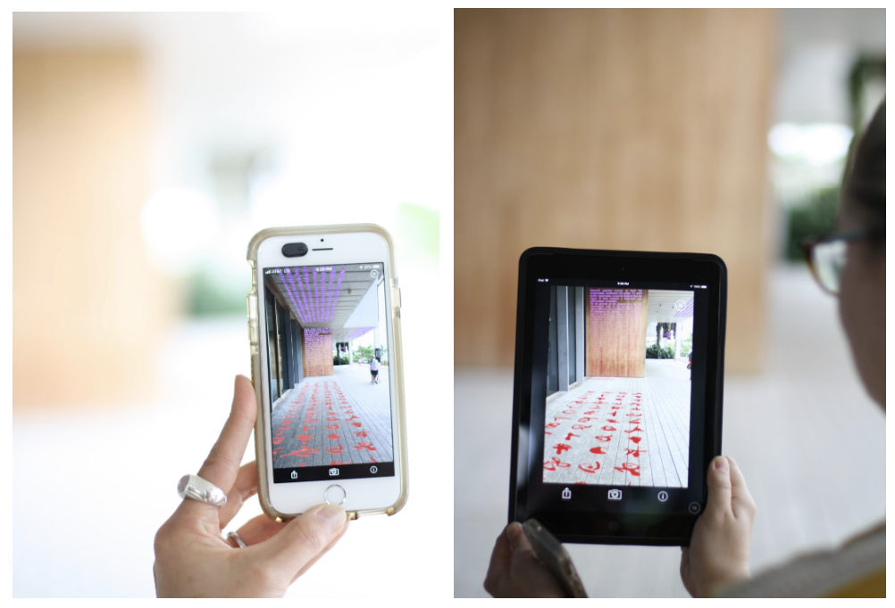
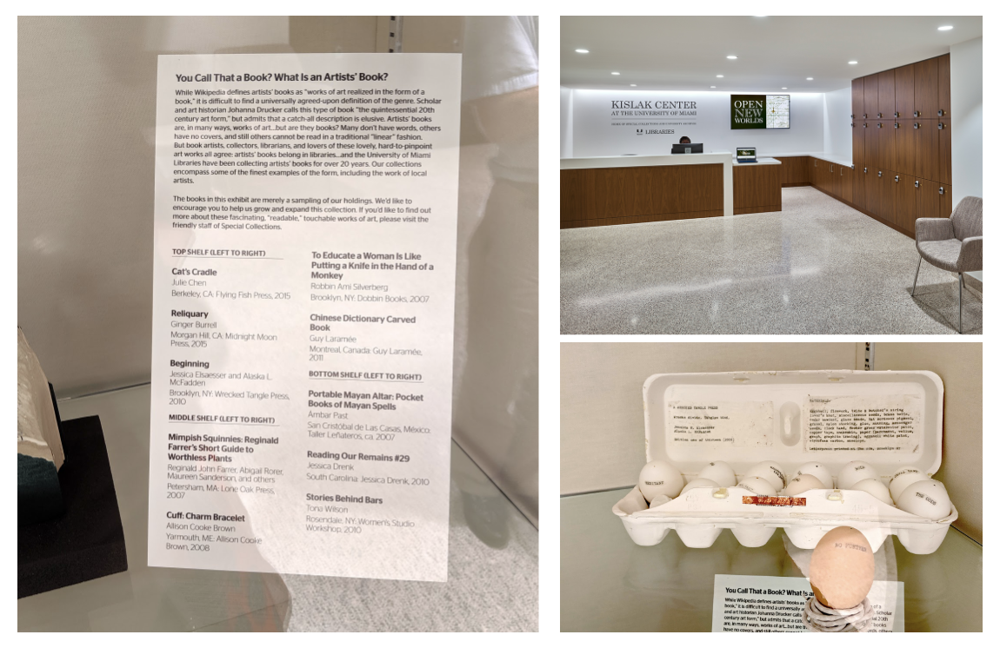

# Summer 2019

## Installations

### This hands-on course explores how to develop interactive installations through surveying art, public & museum installations.

##### View deliverables here:

### Cabinet of Curiosity
* ["Happy Endings" Collection and "Cone Bites" Diorama (click here)](/assets/cone-bite-installation.pdf)

### Prototype
* [Video Projection "A Journey into the Arch" (click here)](https://docs.google.com/presentation/d/1oqAfFOaHtuNZPH_YPvWdomGGapp_7wOL4Ntokv9VrmA/edit?usp=sharing)

### Exhibit Workshop
* [Spring 'Beginnings' Collection Workshop and Egg Hunt (click here)](/assets/beginnings-workshop.pdf)

### Museum Visit Reflections
* [Reflection: Artechouse XYZT: Abstract Landscapes (click here)](https://docs.google.com/presentation/d/1W987_F226covCPN4uO5iDZ1xoJ8Jdp_fo4LZzHmfrs0/edit?usp=sharing)

* [Reflection: Pérez Art Museum Miami (PAMM) Augmented Reality Exhibits (click here)](/assets/reflection-pamm.pdf)

* [Reflection: Kislak Center 'Books' Special Collection (click here)](/assets/reflection-kislak.pdf)

<!-- * [Custom Video Projection Arch for Lowe Art Museum](/deliverables/prototype.md)

### Workshop
* [Spring "Beginnings" Collection Egg Hunt](/deliverables/workshop.md)

### Museum Visit Reflections
* [Lowe Art Museum Reflection](/deliverables/lowe.md)

* [Artechouse](../deliverables/artechouse.md)

* [Kislak Center, UM Library of Special Collections](/deliverables/kislak.md) -->
