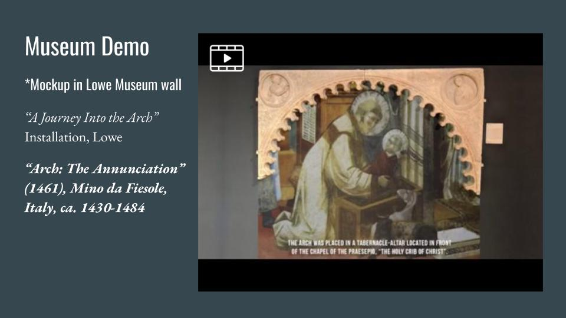

# Summer 2019

## Installations

### This hands-on course explores how to develop interactive installations through surveying art, public & museum installations.

##### View deliverables here:

### Cabinet of Curiosity
* ["Happy Endings" Collection and "Cone Bites" Diorama](/assets/cone-bite-installation.pdf)

### Prototype
* ["Video Projection Masked "Arch" Prototype](https://docs.google.com/presentation/d/1oqAfFOaHtuNZPH_YPvWdomGGapp_7wOL4Ntokv9VrmA/edit?usp=sharing)

<!-- * [Custom Video Projection Arch for Lowe Art Museum](/deliverables/prototype.md)

### Workshop
* [Spring "Beginnings" Collection Egg Hunt](/deliverables/workshop.md)

### Museum Visit Reflections
* [Lowe Art Museum Reflection](/deliverables/lowe.md)

* [Artechouse](../deliverables/artechouse.md)

* [Kislak Center, UM Library of Special Collections](/deliverables/kislak.md) -->
